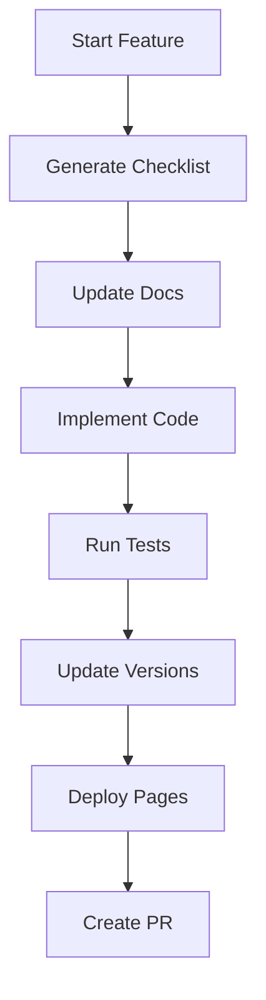

# AI-Driven Development Workflow

Ever wondered how to maintain consistency across your development process while leveraging AI assistance? Our AI-driven workflow combines the flexibility of human creativity with the reliability of automated checks and balances.

## The Magic Behind the Scenes

At the heart of our system lies a powerful `.ai/config.yaml` that guides both you and the AI through each development task. Think of it as your project's DNA - it defines how things should grow and evolve.

### 🎯 How It Works

1. **Start a New Feature**
   ```bash
   ai-dev feature start "Add user authentication"
   ```
   This command:
   - Creates a feature branch
   - Generates a user story
   - Sets up your checklist

2. **Follow the Smart Checklist**
   The AI maintains a living checklist that:
   - Tracks your progress
   - Ensures documentation stays updated
   - Manages version bumps
   - Verifies GitHub Pages deployments

   ```markdown
   ✅ Create user story
   ✅ Set up feature branch
   ⏳ Update documentation
   ⬜ Implement feature
   ⬜ Write tests
   ```

3. **Let AI Guide You**
   As you work, the AI:
   - Reminds you of pending tasks
   - Suggests next steps
   - Helps maintain consistency
   - Tracks version changes

### 🔄 The Development Cycle



## 📋 The Smart Checklist System

Our checklist isn't just a static list - it's a dynamic tool that:

1. **Adapts to Your Project**
   - Pulls configuration from `.ai/config.yaml`
   - Adjusts based on feature type
   - Scales with project complexity

2. **Tracks Progress**
   ```yaml
   status:
     started: "2024-01-20T10:00:00Z"
     lastUpdated: "2024-01-20T15:30:00Z"
     completion: 60%
   ```

3. **Ensures Consistency**
   - Documentation updates
   - Version management
   - Testing coverage
   - GitHub Pages deployment

## 🛠 Configuration

Your `.ai/config.yaml` is where you define:

```yaml
development_workflow:
  feature_development:
    steps:
      # Development steps
  documentation:
    setup:
      # Documentation structure
  versioning:
    strategy: "semantic"
    # Version rules
```

## 🚀 Quick Start

1. **Initialize Your Project**
   ```bash
   ai-dev init
   ```

2. **Start a Feature**
   ```bash
   ai-dev feature start "my-feature"
   ```

3. **Check Progress**
   ```bash
   ai-dev status
   ```

4. **Update Documentation**
   ```bash
   ai-dev docs update
   ```

## 🎯 Best Practices

1. **Always Start with Documentation**
   - Update docs first
   - Let the AI guide the structure
   - Keep the storytelling flowing

2. **Trust the Checklist**
   - Don't skip steps
   - Let it guide your workflow
   - Use it for consistency

3. **Leverage AI Assistance**
   - Ask for help when stuck
   - Let it handle repetitive tasks
   - Use it for version management

## 🤝 Contributing

Want to improve the workflow? The AI can help:

1. Fork the repository
2. Run `ai-dev feature start "improve-workflow"`
3. Follow the generated checklist
4. Submit your PR

## 🔍 Troubleshooting

Common questions and their solutions:

1. **Checklist not updating?**
   ```bash
   ai-dev checklist refresh
   ```

2. **Documentation out of sync?**
   ```bash
   ai-dev docs verify
   ```

3. **Version conflicts?**
   ```bash
   ai-dev version check
   ```

Remember, the AI is here to help! If you're ever unsure about the next step, just ask:
```bash
ai-dev help
```

## 📚 Learn More

- [Configuration Guide](./configuration.md)
- [Command Reference](./commands.md)
- [Templates Guide](./templates.md)
